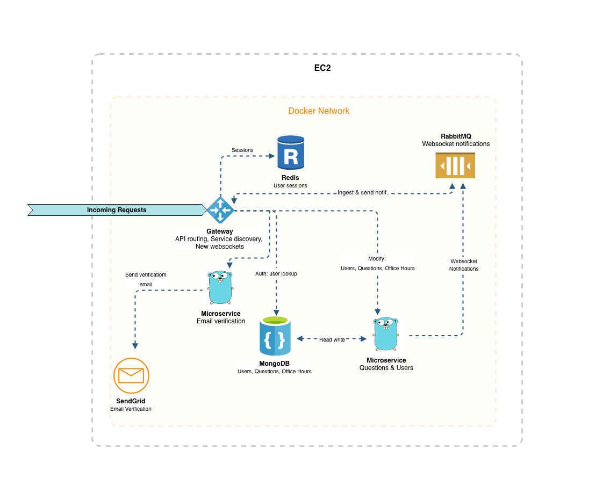
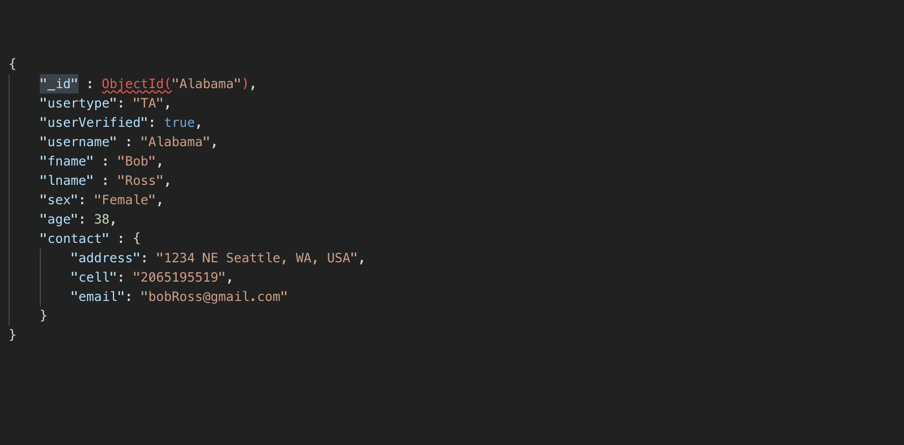
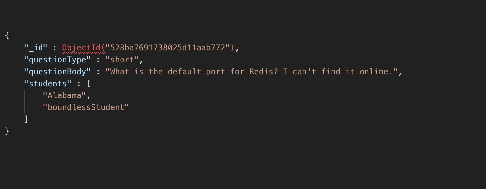

# Teaching Assistant Pal
This project is for the University of Washington, INFO 441 (Server-Side Web Development) Final Project. The requirements of this project are to utilize the knowledge we have gained from this class as well as any additional experience we have to develop a project to showcase our learning throughout the quarter. At a high level, the application we decided to develop will serve as tool for teaching assistants (TAs) to manage their office hours in an effective manner.
### Goals and Objectives
The goal of this project is to improve the efficiency of office hours that teaching assistants hold on campus. Most often, the student who is willing to approach the TA multiple times is the one who is most likely to receive help, not the student who asked for help first. Additionally, there are scenarios in which a student with relatively simple questions that require short, one sentence answers will have to wait while numerous long questions by other students are answered. Hence, we set forth to meet the following objectives:
 -   Improve the overall experience and efficiency in student count that a TA can help in office hours.
 -   Optimize the order in which students are helped to provide a better experience for students with relatively short questions.
### Functional Requirements
 - Provide authentication to track various users (students and TAs) with the platform.
 - Provide verification of UW email address.
 - A student view which allows students to see questions currently in the queue and either join an existing question or create a new one if it is unique, specifying the estimated length of the question (~30 seconds, ~3 minutes, 5+ minutes).
 - A teaching assistant view which allows TA's to visualize the questions currently in the queue, edit question lengths, and modify the order. Also, will give them the ability to broadcast messages to all students in office hours, or student subscribed to a question. 
 - An admin view which allows admins to create TA accounts.
 - An analytics view that allows TAs to analyze their past uses of the Teaching Assistant Pal application.
 - Real time updates of all views via websockets.
### Environment
This application will be deployed via Docker containers on AWS. We will be utilizing GoLang for the API gateway and microservices, as well as Redis, MongoDB, and RabbitMQ to support the application, each of which will be in its own **container** on a docker network. These can be seen below:

Checkout our network diagram at `/images/network2.png`

### User Stories 
| No | Priority |  User | Description
|--|--|--|--|
|1| P0 | As an admin | I want to manage TA/Teacher accounts |
|2| P0 | As a TA | I want to create office hour session |
|3| P0 | As a TA | I want to view the question queue |
|4| P0 | As a TA | I want to complete a question in queue |
|5| P0 | As a Student | I want to view the question queue |
|6| P0 | As a Student | I want to submit a new question to the queue |
|7| P0 | As a Student | I want to add myself to an existing question |
|8| P0 | As a Student/TA | I want to create an account and add user details|
|9| P0 | As a Student/TA | I want to verify my UW email address to get access |
|10| P0 | As a Student/TA | I want to receive live updates |
|11| P1 | As a Student | I want to remove my question from the queue |
|12| P1 | As a TA | I want to reorder questions in the queue|
|13| P1 | As a TA | I want to edit the time length of questions in the queue|
|14| P2 | As a TA | I want to group FAQ and type brief answers|
|15| P2 | As a Student | I want to view FAQ and answers |
|16| P2 | As a TA | I want to broadcast messages to all students in question or all students  |
### Implementation Details
|Story No.| Detail|
|--|--|
|1|This story will require a **React** front end which will hit a **REST API**. The TA or Teacher account will then be stored in **MongoDB**|
|2,3,4,5,6,7,11,12,13,15| This will require a **React** front end and a **REST API** request. All other users will be notified via **WebSocket**|
|8|This will require *React* front end and a **REST API** request, user details stored in **MongoDB**|
|9|This will require *React* front end and a **REST API** request, the email will be sent through *MailChimp* and once the user clicks on the verification link a **REST API** request will be made which will record the account as verified in **MongoDB** |
|10|This will be done via **WebSockets**|
|14|This will be a page served via the **React** Front End|
|16|This will require a **React** front end and **REST API** request. The message will be broadcasted via **WebSockets** to all other users|

### Appendix: Mongo DB Schemas
**User**

**Question**

### Fun Quotes
> John: you guys are like the Alabama of teams for server side
